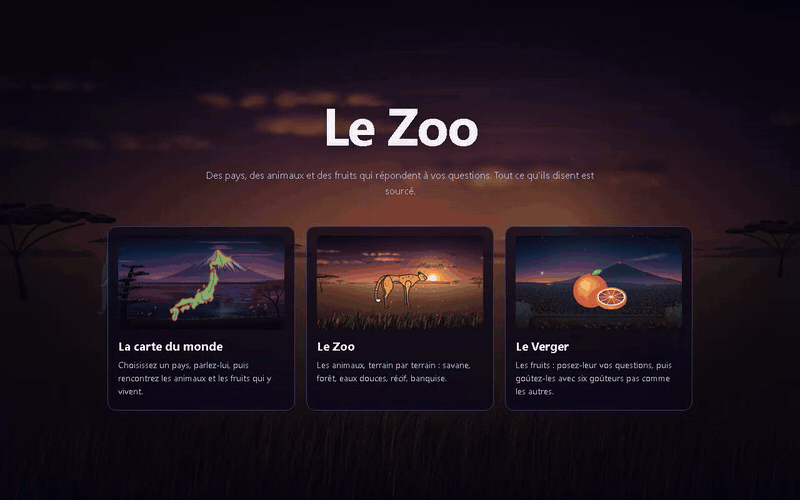

# Le Zoo

<p align="center"></p>

Un site où l'on parle aux animaux, aux fruits et aux pays. L'écran d'accueil est une carte du monde : on clique sur un pays, on entre dans son paysage, et on parle au pays comme à ceux qui y vivent. Deux autres modes, le Zoo (les animaux) et le Verger (les fruits), montrent tout le monde par terrain. Aucune clé API : tout ce qui est dit est écrit dans les fichiers de données.

## L'idée en une phrase

Le contenu n'est pas écrit à la main, il est produit par une chaîne de récupération. La vraie pièce du projet n'est pas le zoo, c'est **le validateur qui refuse de publier ce que la génération invente**.

## Lancer

```
npm install                  une seule fois
npm run dev                  le site, sur http://127.0.0.1:5190
npm run verifier             le validateur, code de sortie 1 si ça bloque
npm run fumee                le test de fumée, même règle de sortie
npm run build                verifier + fumee puis le site final dans dist/ (ce que lance Vercel)
```

Liens directs : `#/carte`, `#/zoo/savane`, `#/verger/tropiques`, `#/pays/ISL`. L'ancienne version « double-clic sur index.html » est gardée dans `_ARCHIVE/v1-fichier/`.

## L'accueil

On arrive sur un accueil. Derrière lui, la savane vit. Il propose trois choix : la carte du monde, le Zoo et le Verger. Chaque choix passe par un écran de chargement, qui peint les décors à l'avance pour qu'aucune scène ne gèle à l'entrée. Le bouton « Accueil » ramène au choix des modes.

## Le lot du 22/09/2026 : chaque pays parle

- **Nouvelles fiches pays** : Mexique, Brésil, Italie, Malaisie, Indonésie, Botswana, Danemark, et les **Comores**, avec deux nouveaux habitants :
  - le **cœlacanthe** (Latimeria chalumnae, « Gombessa ») ;
  - la **vanille**. La papaye a été écartée : aucune source de rang A ne la relie aux Comores, seule la presse le fait.
- **Contrôle** : chaque fiche est passée par la chaîne recherche puis contrôle adversarial, qui a rouvert chaque URL. Les 10 fiches ont été publiées après corrections.
  - Le cœlacanthe a perdu sa seule source interdite, Animal Diversity Web.
  - Sur Mayotte, la fiche des Comores attribue chaque position à sa source (la constitution comorienne, l'Insee), sans trancher.
- **Cartes des pays** : les pays sans dessin fait main sont tracés automatiquement depuis leurs vrais contours (`src/silhouettes-pays.js`).
- **Résultat** : 11 pays parlent sur la carte.

## Les trois modes

- **Carte** (accueil) : les pays de la carte du monde (Natural Earth 1:50m, domaine public). Un pays **brille en or** s'il a sa propre fiche et qu'on peut lui parler, **en vert** si des animaux ou des fruits y vivent, et reste **gris « bientôt »** sinon. Glisser, zoomer à la molette ou au pincement, cliquer pour entrer.
- **Pays** : le paysage du pays, sa fiche s'il en a une, et ses habitants. Le rattachement d'une entité à un pays (champ `pays`) s'appuie toujours sur un fait déjà sourcé dans sa fiche : l'axolotl au Mexique par Xochimilco, le guépard au Botswana par l'étude de Moremi. Les entités sans pays sourcé (manchot, vampire, abeille, baobab, les trois personnages de fiction) restent dans le Zoo et le Verger.
- **Zoo** et **Verger** : les animaux et les fruits par terrain, balayage au doigt pour changer de terrain.

Les animaux vivent : chacun suit une petite machine à états (`src/vie.js`), marche, sautille, se dandine, nage, dérive ou vole selon son espèce, et s'arrête face au visiteur quand on lit sa fiche. Le réglage « réduire les animations » du système ralentit tout sans rien figer.

## Les fichiers

| Fichier | Rôle |
|---|---|
| `index.html` | La page, ses styles, le panneau de dialogue et l'overlay de dégustation |
| `src/main.js` | Le routeur des modes, la boucle de rendu, la souris et les doigts |
| `src/carte.js` | La carte du monde : projection, caméra, survol, zoom animé vers un pays |
| `src/pays.js` | Le lien entre pays et entités : statut sur la carte, habitants, décor de chaque pays |
| `src/scene.js` | Une scène vivante : décor, particules d'ambiance, entités en mouvement |
| `src/vie.js` | Le mouvement de chaque espèce |
| `src/decors.js` | Les décors réalistes peints en code, un par terrain |
| `src/dialogue.js` | Le panneau de dialogue et la dégustation, communs à tous les modes |
| `src/silhouettes.js` | Une fonction de dessin par entité : animaux ressemblants, fruits reconnaissables, pays en vrai contour de carte. Les fruits et les pays n'ont pas d'yeux |
| `src/terrains.js` | Les terrains, la répartition des entités, les décors simples de repli |
| `src/moteur.js` | Normalise la question, score les sujets par mots-clés, gère les couches |
| `src/gouteurs.js`, `src/degustation.js` | Les six goûteurs non humains et le tirage déterministe de la dégustation |
| `src/animaux.js` | Les trois entités **fiction** d'origine |
| `src/monde-documentaire.js` | Les entités **documentaire**, sourcées, avec leurs champs `pays`, `iso3` et `gout` |
| `scripts/verifier.mjs`, `scripts/fumee.mjs` | Le validateur et le test de fumée. Rien ne se publie s'ils ne sont pas verts |
| `docs/prompts-modeles.md` | Les prompts Meshy et Claude Design pour générer les vrais modèles 3D et les décors peints |
| `_travail/` | Les sorties brutes des chaînes de génération et de vérification |
| `_ARCHIVE/` | Fichiers déplacés, jamais supprimés. Voir son README |

Tout est en modules ES, chargés par Vite. Le 3D est prévu : un modèle GLB généré avec les prompts de `docs/prompts-modeles.md` remplacera le dessin 2D d'une entité, entité par entité.

## Les deux modes

Chaque entité porte un champ `mode`.

**`fiction`** : l'entité ne prétend rien. Ses chiffres sont de la parole de personnage. Le validateur les tolère.

**`documentaire`** : chaque fait doit être cité depuis une page réellement ouverte. Une source est un objet complet :

```js
{ type: "reference",
  extrait: "un morceau de texte copié mot pour mot depuis la réponse",
  ref: "Institution, titre",
  url: "https://...",
  consulte: "2026-09-06" }
```

Le validateur bloque si l'`extrait` n'apparaît plus dans la réponse, si l'`url` est malformée, si la date n'est pas au format `AAAA-MM-JJ`, ou si la source est Wikipédia. Une source tertiaire mène à la preuve, elle n'est pas la preuve.

## Les couches

Un sujet peut en verrouiller un autre. `ouvre` désigne ce qu'une réponse débloque, `requiert` ce qu'il faut avoir posé avant. Un sujet répondu s'ouvre lui-même : sans cette ligne dans `moteur.js`, `ouvre` posait l'identifiant de l'enfant pendant que `requiert` cherchait celui du parent, et rien ne se déverrouillait jamais.

## Ce que la production a réellement donné

| Mesure | Valeur |
|---|---|
| Premier lot, sans garde-fou | 41 faits prouvés faux, 64 douteux, 0 fiche propre sur 10 |
| Deuxième lot, sources ouvertes en premier | 6 fiches, 44 pages ouvertes, 111 sources |
| Faits abandonnés faute de source | 52 |
| Sources orphelines supprimées après correction | 14 sur 23 détectées |
| Validateur lancé sur le code déjà livré | 28 erreurs bloquantes |
| Lot ultracode, session 7 (21/09/2026), recherche+écriture+vérification adversariale par agents | 3 entités tentées (guépard, mangoustan, Nouvelle-Zélande), 1 publiée telle quelle, 1 publiée après corrections (2 phrases non soutenues coupées), 1 publiée amputée de 2 sujets puis complétée le même jour avec des sources de remplacement |
| État actuel (21/09/2026) | 18 entités, 97 sujets, 227 sources citées, 5 fruits avec dégustation sur 5, validateur en code 0 |

Les erreurs du premier lot n'étaient pas des fautes de frappe : une source tertiaire recopiée comme primaire dans 7 fiches sur 7, un plafond réglementaire transformé en valeur courante, la carte des zones gustatives de la langue qui est un mythe, un texte de la FDA lu à l'envers.

**La leçon tient dans l'ordre des opérations.** Écrire puis chercher à sourcer produit quatre faits faux par fiche. Ouvrir les sources puis écrire autour produit des fiches qui passent.

## Le référentiel

`_travail/referentiel-brut.json` : 197 pays, 1 731 éléments, chacun avec ses fruits, ses animaux et ses environnements, tous les 197 pays du monde couverts (Europe du Nord et Océanie complétées depuis la première version). **Aucun élément sans source, 49 % sourcés sur Wikipédia**, ce qui est écrit dans les données. C'est un index, il oriente, il n'affirme pas. Aucun de ces éléments ne passe en mode documentaire sans être resourcé sur une référence primaire, wikipédia n'y suffit pas (voir `verifier.js`).

## Le mode vocal

Câblé dans `moteur.js` derrière `VOCAL_ACTIF = false`, et il le reste.

Deux raisons. Le coût, d'abord : du vocal sur une page publique facture chaque visiteur. Un vrai bug, ensuite : un `fetch` depuis `file://` vers `localhost` part avec une origine nulle et CORS le bloque avant que l'agent réponde. Le repli actuel masquerait l'échec en silence. Il faudra servir la page par un serveur local avant d'activer quoi que ce soit.

## La dégustation

Un bouton GOUTER apparaît sous la fiche d'un fruit qui porte un champ `gout`. Il lance une séquence en quatre phases (odeur, attaque, corps, finale), écrite à la main, puis trois réactions tirées parmi six personnages non humains (`gouteurs.js`) : jamais un prénom, pour qu'aucune réaction ne se lise comme un faux avis. Le tirage est déterministe, hashé sur l'entité : recharger la page ne change jamais ce qui est dit, et chaque réaction porte un lien « pourquoi ? ».

**Aucun axe chiffré (sucré, acide, etc.) n'est affiché nulle part.** `_travail/verdict.json` (session 6) a tranché : huit axes sur dix multipliés par des dizaines de fruits, ce sont des centaines de nombres qu'aucune source sensorielle ne portera jamais. La séquence, les ancres verbales et les réactions suffisent à la scène. Cinq fruits l'ont aujourd'hui : durian, fruit du baobab, orange sanguine de Sicile, açaí, mangoustan, chacun avec ses six réactions écrites.

## Le lot du 21/09/2026, produit par des agents

Trois entités de plus, une par catégorie (guépard, mangoustan, Nouvelle-Zélande), chacune passée par la chaîne complète en trois temps : un agent cherche et ouvre de vraies pages (rang A seulement : revues à comité de lecture, IUCN, GBIF, texte réglementaire, jamais Wikipédia), un second écrit la fiche en aveugle des sources brutes à partir du seul tableau de faits, un troisième rouvre chaque URL et cherche tout chiffre ou superlatif non soutenu. Résultat, sans arrondir :

- **Mangoustan** : verdict « publiable », intégré tel quel, dégustation comprise (il partage le terrain tropiques avec le durian, la reine et le roi des fruits côte à côte).
- **Nouvelle-Zélande** : verdict « publiable avec corrections ». Deux phrases non soutenues par la source citée ont été coupées avant publication (le nom vernaculaire et la localisation du kiwi, une comparaison ajoutée sur l'absence de sternum).
- **Guépard** : verdict « rejeté » sur 2 sujets à la première passe. La moitié des faits (composition musculaire, détail du goulot génétique) reposait sur une revue payante dont le texte n'a pas pu être rouvert pour confirmer les citations mot pour mot. Publié amputé une première fois (3 sujets sur 5), puis complété le même jour : deux sources ouvertes de remplacement trouvées (Kohn et al. 2024, *Journal of Experimental Biology*, pour les fibres musculaires ; O'Brien et Johnson 2017, *Journal of Heredity*, en accès libre, pour la diversité génétique et les greffes de peau). Les 5 sujets sont maintenant en ligne, tous revérifiables.

Chiffre qui compte : sur 3 entités, aucune n'est passée intacte du premier coup, et il a fallu une deuxième passe de recherche pour réparer celle qui avait perdu le plus. C'est exactement le taux d'échec que la production originale documentait déjà plus haut dans ce fichier, preuve que la discipline source-d'abord fonctionne aussi appliquée par des agents, y compris pour corriger après coup plutôt que publier à moitié.

## Ce qui reste à faire

Les cinq points de la version d'avant le 20/09 sont faits : référentiel complet (197 pays), navigation par terrains, tactile, smoke test navigateur, dégustation. Ce qui reste, dans l'ordre de `_travail/verdict.json` :

1. Continuer à produire par lots de 6, source d'abord (`_travail/verdict.json`, session 7). Chaque nouveau fruit peut recevoir sa propre dégustation dès sa fiche sourcée, même mécanique.
2. Retrouver une source ouverte pour les 2 sujets coupés du guépard (muscles, détail génétique), ou les laisser dehors.
3. Le mode vocal, toujours câblé derrière `VOCAL_ACTIF = false` (session 8) : nécessite un serveur local, jamais une page publique en l'état. **Pas oublié**, volontairement après.

## Ce que ce projet n'est pas

Ce n'est pas un chatbot. Aucun modèle ne tourne quand un visiteur pose une question : tout est écrit dans les fichiers de données. Et ce n'est pas exhaustif : le corps humain a 206 os, le monde n'a pas un nombre fini d'animaux.
